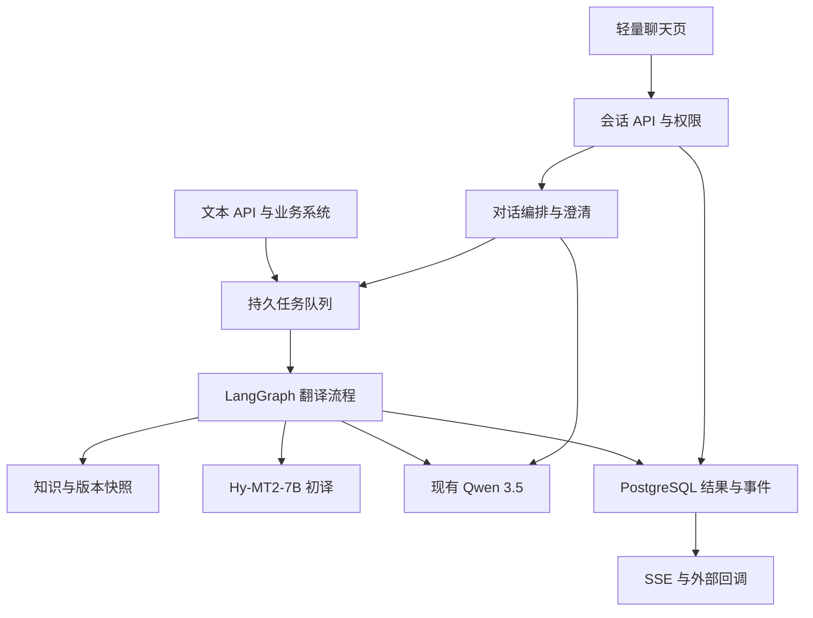
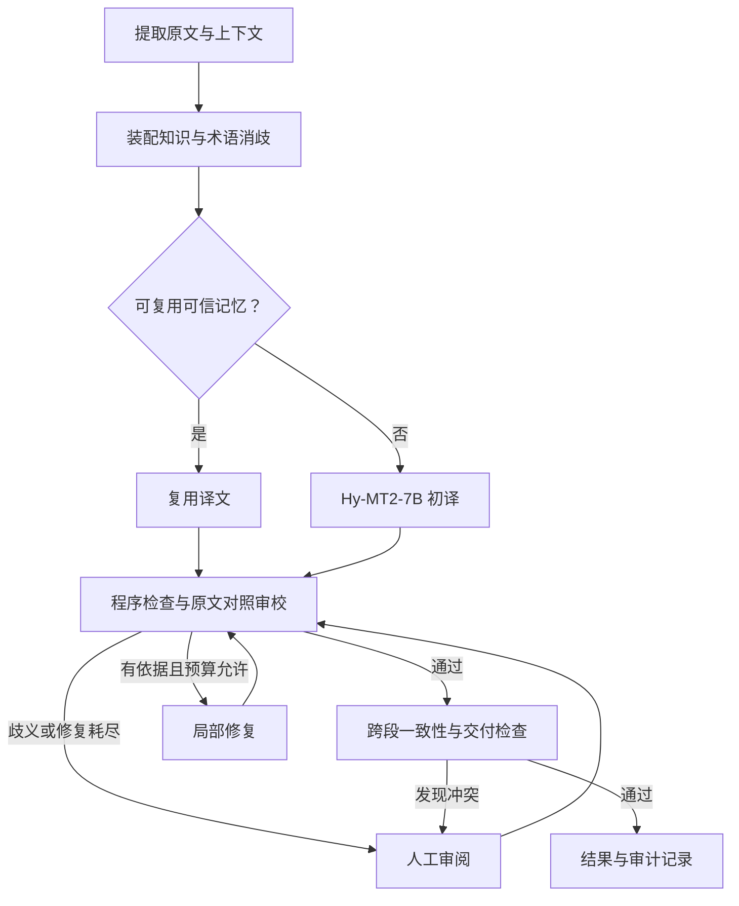

# AI 翻译平台技术方案

版本：1.1 · 日期：2026-09-23 · 状态：实施设计草案，未实施、未完成业务质量验证。

仓库：`xzhencheng/aifanyi`。本版按用户要求将一期收敛为完整后端翻译 Agent＋对话使用，全部文件翻译延期，初定 Hy-MT2-7B＋用户现有 Qwen 3.5。依据为[一期需求基线](requirements.md)，契约见 [Spec](spec.md)，资源估算见[模型部署与服务器要求](model-deployment.md)。本次只更新设计，尚未接通或部署用户模型。

## 1. 目标与设计原则

核心目标是减少真实业务材料中的严重误译、漏译、无依据增译和专业概念误用。流畅度、速度、成本分别统计，不用它们替代准确性。对话体验与翻译语义准确分别验收。

本方案选择“上下文和领域知识约束的初译 → 原文对照审校 → 有依据的局部修复 → 全文一致性与交付检查”。每个增加的模型环节必须通过独立业务样本证明净收益。任务执行成功不代表已人工确认准确；产品界面明确区分自动检查通过和人工审核通过。

### 1.1 一期范围

- 中文、英文、日文六个方向；文本同步/异步、批量文本共用完整后端 Agent。
- 上下文、知识消歧、初译、确定性检查、原文审校、有限修复、人工处理、跨段一致性、记录与恢复。
- 会话/消息/运行 API、轻量聊天页；支持首次翻译、多轮澄清、解释、局部重译、反馈和断线恢复。
- 术语、TM、规则、纯文本领域解释、四级反馈及审核发布 API、版本快照。
- Hy-MT2-7B 初译；现有 Qwen 3.5 审校、修复和对话；保留适配接口但一期不部署第三个模型。
- 身份与项目隔离、任务查询、注册回调、评测和运维。

一期暂缓任何文件上传、解析、翻译、回填和下载，含 Word/Excel/PDF/OCR/PPT/图片；不依赖文件对象存储。完整管理工作台和模型微调为后续工作。轻量聊天页仅承担使用入口，所有质量与权限判断在后端。

### 1.2 决策类型

| 类型 | 本文含义 |
| --- | --- |
| 设计基线 | 开发按此实现；修改时同步更新 Spec 与决策记录 |
| 可配置初值 | 为实现和试点提供具体默认值，不是生产性能或质量承诺 |
| 待评测选型 | 保留可替换接口，不能将未经评测的模型标为正式上线 |
| 部署前输入 | 客户网络、身份系统、模型许可、设备资源、数据周期等环境参数 |

原方案的“99% 术语正确率、P95 5 秒、99.9% 可用性”等均为建议目标。准确性优先模式包含审校，响应时延须重新压测，不通过跳过审校来兑现旧目标。

## 2. 准确性的工程定义

| 维度 | 核查对象 | 举例 |
| --- | --- | --- |
| 原意与逻辑 | 主体、动作、对象、否定、条件、范围、因果、先后关系 | “确认后才允许”不能变成“操作后确认” |
| 信息完整 | 原文信息是否覆盖、译文是否加入无依据内容 | 限制条件和例外不能丢失 |
| 专业概念 | 术语是否适用于当前产品、部件和语境 | 同一简称在不同产品中可能指不同部件 |
| 参数关联 | 对象—参数—数值—单位—约束关系 | 数字集合相同但对应对象交换仍是错误 |
| 文本一致性 | 指代、简称、同一概念、交叉引用与表达约定 | 多段文本中同一部件名称前后冲突 |
| 交付完整性 | 消息原文、片段、目标版本与结果绑定 | 正确译文关联错会话或错段落也属于失败 |

错误严重度采用项目规则：`critical` 表示可能改变安全操作、关键技术约束或造成重大业务后果；`major` 表示实质性改变或遗漏含义；`minor` 表示不改变关键含义的小问题。纯风格偏好单独记录，不计入语义错误。

数字、型号、ID 等确定性检查由程序执行；语义关系由原文对照审校和人工验证共同处理。模型分数只能辅助排序，不作为单独放行条件。语义审校并非形式化证明。

## 3. 总体架构与技术基线

采用模块化单体 API＋独立 Worker。对话层理解用户意图，翻译层执行显式流程；两个入口共用同一内核，避免聊天模式绕过审校。

| 层 | 设计基线 | 约束 |
| --- | --- | --- |
| 对话入口 | TypeScript、React、Vite 的轻量聊天页 | 只做聊天、原译对照、反馈/授权审阅和状态；不含完整管理台 |
| API | Python、FastAPI、Pydantic | 身份、Schema、幂等、会话/任务查询与事件；长动作异步 |
| 编排 | LangGraph 显式状态图 | 对话意图与翻译图分开，持久化暂停和有限循环 |
| 数据库 | PostgreSQL、SQLAlchemy、Alembic | 会话、消息、run、原文、任务、知识、审计和 Outbox |
| 检索 | SQL 精确/词法；pgvector 可选 | 先权限过滤；不新增独立向量库作为必要依赖 |
| 调度 | Celery、Redis | 至少一次派发、限流；真实状态以数据库为准 |
| 模型 | Hy-MT 独立私有 HTTP；已有 Qwen 服务 | 分角色适配/预算，共享端点配额；不改变现有 Qwen 部署 |
| 身份 | 企业 OIDC；机器用注册客户端 | 同样保护会话、事件流、知识和人工裁决 |
| 可观测 | 日志、指标、ModelCall、质量记录 | 正文默认不进普通日志；阶段耗时与版本可追溯 |

一期原文与结果为纯文本，保存于数据库；不建设文件解析模块、S3 集成或文件 Worker。数据规模增长时再评估存储拆分。运行时、依赖和模型镜像在 MODEL-01 锁定，不用浮动 latest 作为交付基线。

## 4. 专用翻译模型与通用审校模型

### 4.1 初定 Hy-MT2-7B＋现有 Qwen 3.5

| 角色 | 初定模型 | 职责 |
| --- | --- | --- |
| translator | Hy-MT2-7B，先 BF16 | 使用目标原文、适用术语和背景生成忠实候选；不承担会话工具调用 |
| reviewer | 用户已有 Qwen 3.5 | 对照原文找错，输出覆盖列表和定位，不读取初译隐藏推理 |
| repairer | 同一 Qwen 3.5 服务 | 按已验证问题修复，再走完整检查 |
| conversation | 同一 Qwen 3.5 服务 | 意图提取、缺参澄清、有依据解释；动作由程序白名单派发 |

用户已确定初步组合，不再将 TranslateGemma 或 Qwen-MT API 纳入一期部署任务。适配器仍可替换；如后续试点质量不足，先记录问题并优化，不静默换模型。Qwen 3.5 的具体大小、精度、端点与空闲容量未知，不能擅自按某一规格规划。

私有部署不等于领域微调，也不自动提高准确率。双模型效果以业务数据证明；Qwen 同时审校和修复存在相关错误，不能将复查当作独立真值，仍由确定性门槛、人工盲评和高风险终审约束。

官方模型示例核验日期为 2026-09-23 [R6][R8]。交付记录 checkpoint/revision、Tokenizer/Chat Template、推理后端、精度、采样和许可；权重与真实语料不进仓库。

### 4.2 模型能力适配

`TranslatorAdapter` 接收平台标准片段并使用 Hy-MT 官方任务模板；`ReviewerAdapter` 输出平台错误结构；`RepairAdapter` 返回候选修订；`ConversationAdapter` 输出意图和证据引用。角色接口、提示和调用记录独立。

每个适配器登记：支持语言方向、输入/输出限制、术语干预、参考上下文、参考译文、结构化输出、行内标记、批量映射和部署边界能力。不支持某项必须显式报告，由路由选择已批准的替代路径，不能静默丢弃约束。

某些专用翻译模型只输出文本：默认每个语义片段一次请求，由程序绑定 `segment_id`。只有通过 ID 覆盖和分隔保留测试的适配器才能在一次模型请求中装入多个目标片段。推理服务动态批处理多个独立请求，不等于把多个段落拼成一条提示。

对不能直接使用必要上下文/术语的候选，可在实验组比较“专用初译＋带知识的修复”，但上线前必须证明满足同样的知识约束。不得把错误拼接的上下文当待翻译内容发送。

### 4.3 模型组合实验

| 组别 | 初译 | 知识与上下文 | 审校修复 | 目的 |
| --- | --- | --- | --- | --- |
| E0 | 现有 Qwen 3.5 | 最小必要原文输入 | 无 | 单模型参考基线 |
| E1 | 同一 Qwen 3.5 | 完整且相同的知识包 | 无 | 测知识包净收益 |
| E2 | Hy-MT2-7B BF16 | 其适配器支持的相同知识；差异必须记录 | 无 | 测专用初译能力 |
| E3 | Hy-MT2-7B BF16 | 完整知识要求 | 现有 Qwen 3.5 审校与定向修复 | 测用户提出的双模型路径 |
| E4 | 同一 Qwen 3.5 | 与 E1 相同 | 与 E3 相同的审校策略 | 避免把所有改进归因于专用模型 |

按中→英、英→中、中→日、日→中、英→日、日→英分别评测；E3 为初定上线路径，其他组作对照；不达标方向保留人工试点，变更生产组合需显式登记。使用验证集选定模型和对照基线后再锁定测试，不能在测试集上反复选优。原文信息范围、允许知识和样本划分保持可比，模板差异单独记录。选型优先看严重错误和语义净收益，再看成本与时延。

### 4.4 部署和资源策略

Hy-MT2-7B 单独部署，已有 Qwen 3.5 通过私有 API 复用。**起步预算：Hy-MT 独占 24 GB GPU、64 GB RAM、16 vCPU、200 GB 可用 NVMe；新增资源建议评估 48 GB GPU、128 GB RAM、32 vCPU、500 GB 可用 NVMe。** 都是工程估算而非已验证最低要求/性能承诺；应用节点另计。BF16、8192 总上下文、24 GB 档先 1 活跃序列，容量验证后逐档调优。

官方文件约 16.1 GB；按 32 层、8 KV heads、128 head_dim、BF16 推算每 token KV 约 128 KiB，8192 token 单请求约 1 GiB KV，尚需激活和框架余量 [R10][R11]。不把 262144 最大位置配置当作 24 GB 卡的服务窗口。详细配置、软件兼容性、启动参数模板及推算边界见[模型部署要求](model-deployment.md)。

Qwen 端点的 conversation/reviewer/repairer 共享配额，优先保障审校和修复；登记实际窗口、输出限额、思考模式与 JSON/工具能力。不能由每个 Worker 各自放大并发。模型不可用时显式失败/暂停，不跳过审校或静默改路由。

一期不微调。量化、LoRA/SFT 为后续经数据和效果证据批准的实验，必须分离训练/盲测并验证六方向退化；本页服务器为推理预算，不含训练。

## 5. 领域知识与上下文

### 5.1 知识资产

| 资产 | 必要内容 | 用法 |
| --- | --- | --- |
| 术语 | 概念 ID、定义、源语别名、目标语译法、允许变体、禁用译法、产品/部件/领域、例句、来源、锁定 | 原文匹配后消歧；检查概念和语境，不能只查目标字符串 |
| 翻译记忆 TM | 原文、译文、语言方向、上下文指纹、来源、审核、适用范围、知识兼容性 | 精确匹配通过资格检查才复用；相似结果仅参考 |
| 规则 | 语言/领域适用条件、强制与偏好、保护项、风格、审校和人工门槛 | 程序先合并为唯一有效配置，模型不得自行越权修改 |
| 领域解释材料 | 经过审核的产品说明和概念解释片段、定位、版本、适用范围 | 辅助消歧，不能补充原文没有的事实 |

领域解释材料复用知识审核和版本管理，不另建一个无边界的通用知识库。一期接受人工整理的纯文本解释片段；不因此扩大到 PDF/OCR 自动入库。

选择顺序：先按租户、项目权限、状态、语言方向、产品等筛选，再检索；企业强制/锁定项优先。非锁定项按“明确本次覆盖 → 当前用户个人项 → 项目项 → 企业默认”选择，只有允许覆盖的键能被覆盖。两项同优先级冲突进入待确认，不随机取第一条。项目机器任务默认不应用个人知识，只有明确授权的用户委托才可使用。

TM 是候选译文，不是高于规则的权威。复用要求原文精确匹配、上下文兼容、人工批准、适用范围正确、术语/规则版本兼容，并再次进行检查。旧术语影响的 TM 标记待复核，不能盲目全句替换。

### 5.2 上下文构建

- 保存原始文本和不损失语义的检索规范化文本，不能删除否定、单位、大小写敏感型号或标点关系。
- 文本按段落、标题和列表关系组织；批量条目显式携带只读上下文，不能把相邻但无关联条目自动合并。
- 片段分开保存 `source_text` 与 `context_refs`。模型输出只对应目标片段，参考文本不重复翻译。
- 标题、产品/部件和背景优先从用户明确提供的信息和项目配置取得，记录消息与版本来源。对话摘要只供检索导航，不能替代原文或被认定为事实。
- 明显缺失上下文、混合语种歧义、文本定位不可靠时标记问题。不能通过擅自修正原文消除疑点。
- 任务内概念选择在并发初译前尽量统一；新发现冲突保存待确认决策并重检关联片段，不让不同 Worker 各自写公共词表。

### 5.3 快照与缓存

创建任务时冻结知识发布版本、用户覆盖版本、检索器/Embedding 版本、模型路由和提示模板配置。每次检索保存命中条目及版本；后续发布不改变任务快照。实际模型调用的检查点和参数另行记录。

缓存键包含租户/权限范围、源文哈希、语言方向、上下文指纹、知识快照、模型/提示/推理参数和相关覆盖版本。系统生成缓存与人工批准 TM 分开；命中缓存不自动获得人工批准资格。不可通过只按源文字符串缓存造成跨项目泄漏或错用译文。

## 6. 翻译工作流与 Agent 边界

默认生产策略为 `accuracy_first`：每个目标片段均经过确定性检查与语义审校，包含复用 TM 的片段。跳过部分审校的快速策略仅作为离线实验，未通过独立评测不得默认上线。

| 节点 | 执行者 | 主要输出 |
| --- | --- | --- |
| `validate_input` | 程序 | 授权、语言、纯文本类型及限额检查 |
| `extract_segments` | 程序 | 文本分段、稳定片段 ID、原文偏移和保护映射 |
| `build_context` | 程序为主 | 上下文引用、概念候选、歧义信号 |
| `resolve_knowledge` | 程序；必要时模型建议消歧 | 唯一知识包、有效规则、证据、待确认冲突 |
| `translate` | 模型或可信 TM | 译文候选、引擎记录、片段覆盖信息 |
| `check_deterministic` | 程序 | ID、空值、保护项、格式、术语候选问题 |
| `review_semantics` | 审校模型 | 有来源位置的语义问题，包含审校覆盖的全部片段 |
| `repair` | 修复模型 | 新候选修订、对应问题 ID；不覆盖初译记录 |
| `quality_gate` | 程序 | 通过、修复、人工审阅或技术失败 |
| `check_document` | 程序加按需跨段语义复核 | 同一概念、引用和参数的一致性问题 |
| `assemble_result` | 程序 | 文本结果、覆盖报告、任务与会话事件 |

LangGraph 状态保存 ID、阶段、片段引用、预算计数和快照标识；完整原文与全量历史译文按引用读取，不放入不断增长的聊天提示。业务数据库保存真实结果，检查点负责恢复位置。使用持久 Checkpointer，暂停人工审阅时释放执行资源。节点重放及队列重复投递需要业务幂等配合 [R1][R2][R3]。

对话助手仅能调用经鉴权的首次翻译、查询、解释、重译和反馈草稿接口。源文和检索材料均作为待处理数据，不能改变系统流程、发布知识或指定外部工具地址。助手产生的译法解释引用实际命中知识，不伪造原始模型推理过程。

## 7. 审校、修复与人工裁决

### 7.1 审校契约

审校读取原始片段、必要上下文、候选译文、已解析的术语和规则。复杂或高风险句额外核对“主体、动作、对象、否定、前置条件、范围、参数关联”等原文命题。命题抽取同样可能出错，必须保留可回查的原文锚点，不把抽取结果作为替代原文的真值。

每个问题包含：类型、严重度、片段 ID、源文位置、译文位置、依据、适用术语/规则 ID 和修复建议。纯润色建议单独返回。漏译允许译文位置为 `null`；增译允许源文位置为 `null`；必须满足相应类型的证据约束。程序检查锚点范围及原文逐字匹配，拒绝不存在的证据。

`reviewed_segment_ids` 必须覆盖本批所有目标片段；空问题数组只有在覆盖完整、输出有效且没有其他阻断问题时才可参与放行。不接受只返回总分的审校。

### 7.2 修复和放行

- 每个片段自动质量修复最多 2 轮。修复只针对有依据的错误，保留原始候选和每次修订。
- 修复后重新检查完整目标片段；涉及术语、指代和引用时同时重检关联片段。
- 有效证据显示修复退化时恢复上一候选并进入待审，不默认取最后一版。
- 未解决 `critical` / `major`、硬性保护或映射问题、审校失败、原文歧义均不得自动发布正式结果。
- 高风险场景即使模型未发现问题，仍需具备项目审核权限的人员终审；风险策略的下限由服务端规则确定。
- 人工可以纠正误报，但须记录证据。真实严重错误必须修改译文或更正源文；不能通过“忽略”把它标为准确。
- 源文更正创建新源文版本和子任务。新知识也以新快照创建重译子任务，不能篡改旧任务使用的依据。
- 一次人工修订最多触发 2 轮自动修复；所有修订保留累计次数。频繁反复转人工时标记升级，不无限循环。

平台的 `auto_passed` 只表示按该版本策略检查通过；`human_approved` 表示有人工裁决记录，两者都不表达无限范围的“保证正确”。研究报告了审校修订在特定数据上的收益，也报告了收益可能主要来自流畅度，必须用本项目数据验证 [R4][R5]。

## 8. 业务对象、状态与恢复

| 对象 | 作用 |
| --- | --- |
| Translation / Revision | 用户可见的翻译成果身份与不可覆盖的结果版本 |
| Job / Attempt | 一次执行及技术重试记录 |
| SourceArtifact / Segment | 不可变纯文本与精确原文位置映射 |
| Conversation / Message / AgentRun | 会话归属、消息序号、意图、引用、澄清及运行状态 |
| AgentEvent / ContextSnapshot | 可恢复事件游标与本次使用的对话上下文版本 |
| Candidate / Issue / ReviewDecision | 初译、修订、问题与人工裁决 |
| KnowledgeEntry / Release / Snapshot | 知识草稿、发布和任务固定依据 |
| ModelProfile / ModelCall | 组合配置与每次真实调用信息 |
| Feedback / Proposal | 用户修正及待审核知识建议 |
| OutboxEvent / CallbackDelivery | 可靠业务事件及独立通知状态 |

任务公开状态：`queued`、`running`、`awaiting_review`、`succeeded`、`failed`、`canceled`。内部阶段和片段状态另存，不能把模型流式输出百分比当准确进度。完成计数以通过门槛的目标片段为准。

`succeeded` 要求全部目标片段可发布、跨段一致性通过且结果引用可用。已是目标语言的片段单独统计。待人工审阅时可以查看标明版本的草稿，正式结果接口返回未就绪；不能因对话回答已发出就将任务标为成功。

外部队列按至少一次交付设计。Worker 通过数据库租约与版本条件更新取得任务；结果以唯一执行键写入。提交完成结果和 Outbox 事件置于同一数据库事务。模型外部请求若在响应返回前网络中断，可能已经产生费用；没有供应方幂等支持时不能保证只调用一次，应记录 `outcome_unknown`。

取消在批次边界生效；迟到响应可以留存审计，但不能覆盖已取消任务或发布结果。技术重试仅在快照、原件和策略仍可使用时继续，否则拒绝并要求新任务。原件或知识历史版本被清理后不能假装可完整回放。

## 9. 对话使用与 API

### 9.1 对话编排

会话绑定用户/授权客户端和项目；保存不可变消息及递增序号。每次用户消息生成 AgentRun，记录意图、源消息切片、目标语言、背景引用、目标成果/修订和关联任务。意图限定为 `translate/explain/retranslate/feedback/query/clarify/unsupported`，不能调用任意工具。

Qwen 对话输出只作为计划建议，程序验证原文切片逐字一致、引用权限、版本和所需字段。缺少原文、目标语言或“这一段”目标不唯一时先澄清。只读查询与解释不触发重译；首次翻译/重译必须进入同一准确性内核。翻译结果由程序读取已保存版本呈现，不再让聊天模型自由改写最终译文。

对话状态与翻译状态独立：缺参为 run.awaiting_input；质量阻断关联 job.awaiting_review；技术失败明确返回错误。解释可以 completed 而没有翻译任务；只有关联 job.succeeded 才能发正式翻译完成事件。具体状态与事件见 Spec 第 9 节。

### 9.2 上下文和多轮修订

- 原文、用户指令、背景分别保存；SourceArtifact 不可被摘要、先前译文或反馈覆盖。
- 目标语种/风格等会话默认值允许继承，但必须在运行记录和对话结果中显示，企业锁定不受对话覆盖。
- “第二段改一下”绑定明确的 translation_id、base_revision、segment_ids；不唯一先澄清。重译以原文为起点，引用旧译文但不以译文反推原文。
- 既有任务新增背景或原文更正创建子任务/新版本，旧快照和原文不改。用户回复澄清只作用于指定 run/question，不广播修改整个会话历史。
- 会话更早背景只有经明确关联才进入任务；压缩历史不能丢掉原文、强制术语和用户确认。引用不可用时询问或报错，不靠记忆补造。
- 反馈先明确作用范围，项目/企业只建草稿；自然语言认可不充当高风险人工终审。

### 9.3 对话交付与恢复

一期提供轻量聊天页：项目/语种、输入、会话历史、阶段状态、原译与问题、澄清、局部重译、反馈和有权限的审阅动作。完整知识/模型/评测配置页面延期；维护先使用后端 API。

`POST /agent/messages` 持久接收后返回 202 和 run 引用；SSE 提供阶段、澄清、待审和正式结果事件，断线后用游标续接或查询 run。事件持久化、至少一次，客户端按 event_id 去重；数据库提交结果与事件后才推送。

不向用户流式输出未完成审校的初译 token；默认发送阶段状态，待审时显示带质量标签的候选。最终译文直接来自确定版本的结果。SSE 断线不取消执行，取消使用显式接口，客户端不因重连重新创建任务。

文本同步接口保留 1000 Unicode 码点、默认 60 秒等待上限，超时附已有任务引用；长文本/批量共用异步流程。对话默认异步，不因用户等待而省略质量步骤。API 规范见 Spec 第 6 节。

## 10. 延期范围与兼容边界

Word/Excel 全部能力、文件上传/下载、OOXML 解析/保护/回填、对象存储和完整管理工作台移出一期。原 v1.0 设计在 Git 历史中保留，不需要为延期能力实现空接口或占位模块。

一期输入仅 JSON 文本/批量文本；`kind=file` 返回不支持输入错误，未知 `/files` 路径不注册。粘贴的文本不得被自动解释为文件 URL 去下载。后续恢复文件范围时另行定义原件、定位、保真、存储、安全和验收，不将一期文本达标视为文件翻译达标。

## 11. 反馈与持续改进

仅本次修正形成新译文修订；个人修正写个人层；项目/企业修正经对应审核人发布。企业锁定项不可由普通反馈覆盖。

修正归因区分：术语缺失、概念误解、上下文不足、原文歧义、模型误译、分段/引用异常和风格偏好。AI 提议类别，审核人确认。整句修正不自动拆成公共术语；自动初译不自动成为正式 TM。

确认的错误进入有版本的回归集。进入训练/检索示例的数据不得继续充当独立测试样本；保留新的盲测集防止测试泄漏。模型或提示升级必须与旧版本成对比较，可按语言方向回滚。

## 12. 评测体系与发布门槛

### 12.1 数据集与标注

首轮可从 300–500 条具有上下文的脱敏样本启动候选筛选；正式验证依据覆盖程度和统计区间扩展，原方案 500–1000 条为建设参考，不是置信度保证。覆盖六方向、维保/手册/通知、表格短句、混合语种、否定/条件/数值等难例。

按文档/项目划分调试、验证、锁定测试集，去除近重复。评估者不看模型身份，懂业务的双语人员标注，严重问题和分歧复核。参考译文不是唯一正确答案，准确性优先按原意判断。

### 12.2 指标

| 指标 | 口径 |
| --- | --- |
| 严重错误片段率 | 含至少一个 critical 错误的片段数 / 可评估目标片段数 |
| 实质错误片段率 | 含 critical 或 major 的片段数 / 可评估目标片段数 |
| 漏译/增译片段率 | 含相应语义错误的片段数 / 可评估目标片段数 |
| 术语误用率 | 错误使用次数 / 经人工确认的适用术语出现次数；无适用项记 N/A |
| 必要人工修改率 | 需要改变含义相关内容的片段数 / 可评估片段数；风格偏好另计 |
| 审校召回与误报 | 对人工标注问题做匹配，分别统计严重问题漏检和无依据报错 |
| 修复净收益 | 同批片段修复后相对修复前的语义错误变化，并列纠正数和新增数 |
| 自动覆盖率 | 无需人工即可正式交付的片段数 / 全部目标片段数 |
| 对话完成与恢复 | 可执行翻译意图的正式完成率；澄清完成、断线恢复、重复动作及错误目标绑定分别统计 |
| 效率指标 | 按方向/模式统计 P50/P95 时延、吞吐、用量和单位成本 |

未完成、拒译、待审不能从分母中静默剔除；同时报告全输入集处置情况与可评估子集指标。不同语言分层报告，不用大量简单句掩盖高风险方向失败。自动评估器可作辅助；不能把模型评分 0.95 展示成“95% 准确”。

### 12.3 一期拟采用的上线判定

1. 所有关键保护、隔离、证据定位和已知严重误译回归用例通过；锁定测试集不得出现尚未解决的 critical 错误。
2. 对拟上线的语言方向，以 E3 与预先确定的最强单模型对照比较，E4 作为归因对照。实质错误片段率不劣化，语义错误改进有成对评测证据；用文档级成对重采样给出 95% 区间。若区间不能支持提升，只能认定尚未证明增益，继续试点或维持此前已经通过门槛的生产组合；不静默用 E4 替换用户初定模型。
3. 术语正确率参考目标 ≥99%，但以已确认适用项和明确样本覆盖为前提。其余绝对质量阈值、最低自动覆盖率和评测规模在试点评审中按场景登记，未登记不开放该场景生产路由。
4. 保留人工审阅可见性，不能通过把全部内容转人工来声称自动翻译更准确。
5. 数据集、标注版本、组合配置、Tokenizer、硬件/量化、抽样方法和报告必须可重现。评测零观测严重错误不等于真实总体错误率为零。

## 13. 安全、回调与运维

鉴权和项目范围限制在所有检索、会话、事件流、任务和审阅接口执行；正文、密钥和真实客户语料不进入公开仓库。静态与传输加密由部署提供，生产正文追踪默认关闭。密钥只保存 Secret 引用。

客户端只提交登记的回调编码。端点与客户端、项目/环境绑定，停用立即阻止新投递。只连接经过审核的 HTTPS 目标，不跟随重定向；DNS 与目标网段按部署允许清单检查，内网集成需显式登记，拒绝本机和云元数据等禁止目标。

一期回调基线为 HMAC-SHA256；mTLS/OAuth2 为后续适配，不声称已实现。业务结果和 Outbox 原子提交；通知失败不反转翻译完成状态。重试共享 `event_id`，调用方去重。任务查询作为兜底。

模型初译、审校和修复分别限流，处理供应方并发、超时、429 与输出截断。审校不可用时任务重试或失败/待审，不直接放行未经审校结果。记录阶段耗时、模型使用量、队列积压、问题类别、修复净收益和回调积压。

定期备份数据库、会话/任务关联和快照并演练恢复。保留周期显式配置，已清理的原文/结果返回 `410`，事件游标过期返回重查指引；保留最小审计元数据并报告回放受限。一期不依赖文件对象存储。

## 14. 实施顺序与验收产物

| 里程碑 | 核心交付 | 完成条件 |
| --- | --- | --- |
| M0 模型与基线 | Hy-MT 部署 PoC、现有 Qwen 接入、纯文本样本、E0–E4、容量记录 | 固定两模型配置与未知项，得到质量和容量初始证据 |
| M1 内核与单轮对话 | 数据/快照、初译/审校/修复/人工暂停、文本 API、会话运行和轻量聊天 | 用户通过对话完成一轮真实翻译与审校；失败不能伪成功 |
| M2 多轮与可靠性 | 澄清/解释/重译/反馈、治理 API、恢复/取消/权限、SSE/回调 | 对话可持续使用，版本与原文不漂移，重连不重复翻译 |
| M3 试点交付 | 六方向盲评、模型发布、容量压测、部署和运维手册 | 一期有效需求及验收通过，有证据支持准确性与资源配置 |

文件能力及完整工作台列为后续阶段，不再设一期 Office 里程碑。详细工作包见[实施清单](implementation-plan.md)，当前勾选完成的仅为文档调整。

## 15. 风险与部署前输入

| 项目 | 当前处理 | 上线前必须取得的依据 |
| --- | --- | --- |
| 专用模型是否优于通用模型 | E0–E4 对照，不预设结论 | 按语言方向的业务盲评 |
| 审校幻觉与过度修改 | 证据定位、保留旧候选、回归、人工分歧处理 | 召回、误报及净收益报告 |
| 私有推理容量 | Hy-MT 24/48 GB 预算，Qwen 复用现有服务 | 实际硬件、Qwen 型号/额度、软硬件版本和压测 |
| 知识质量 | 定义、范围、来源和发布审核 | 权威词表、领域负责人、脱敏资料 |
| 原文固有歧义 | 显式待确认，源文更正另建版本 | 业务解释与裁决人员 |
| 对话指代和上下文漂移 | 原文切片、明确版本、歧义澄清 | 多轮样本、错目标绑定和摘要失真验证 |
| 企业身份与数据边界 | OIDC 与注册客户端，默认私有 | IdP、网络、外部模型允许清单、保留周期 |
| 模型使用与分发 | 记录所选权重和许可版本 | 部署主体确认使用、微调、分发条件 |

## 16. 技术依据

以下来源用于核对框架能力及候选模型可用性，不代表本项目效果已经获得验证。本文其余流程、门槛和接口为项目设计。访问日期：2026-09-23。

- [R1] [LangGraph：Workflows and agents](https://docs.langchain.com/oss/python/langgraph/workflows-agents)：区分显式流程和动态 Agent。
- [R2] [LangGraph：Persistence](https://docs.langchain.com/oss/python/langgraph/persistence)：工作流状态持久化。节点恢复仍需业务幂等设计。
- [R3] [Celery：Tasks](https://docs.celeryq.dev/en/stable/userguide/tasks.html)：任务确认、重试和幂等约束。
- [R4] [TEaR，NAACL 2025](https://aclanthology.org/2025.findings-naacl.218/)：所测数据中，翻译、评价和修订提高了质量。
- [R5] [What Does LLM Refinement Actually Improve? ACL 2026](https://aclanthology.org/2026.acl-long.268/)：文学文档实验中，修订收益主要来自流畅度；不可直接外推电梯技术资料。
- [R6] [Tencent Hy-MT2 官方仓库](https://github.com/Tencent-Hunyuan/Hy-MT2)：权重、推理与任务输入示例。
- R7 为 v1.0 的其他候选来源，当前不作为一期模型选型依据。
- [R8] [Qwen3.5 官方规格示例](https://huggingface.co/Qwen/Qwen3.5-35B-A3B)：接口与思考模式字段；不推定用户部署规格。
- R9 为 v1.0 的 API 候选来源，当前不作为一期部署依据。
- [R10] [Hy-MT2-7B 官方文件列表](https://huggingface.co/tencent/Hy-MT2-7B/tree/main)：权重体积。
- [R11] [Hy-MT2-7B 官方配置](https://huggingface.co/tencent/Hy-MT2-7B/blob/main/config.json)：用于 KV 容量推导。完整部署参考见[部署要求](model-deployment.md)。

## 17. 与 Spec 的关系

本方案说明“为什么这样设计、如何实现”；[Spec](spec.md)规定 MUST/SHOULD、数据与接口契约、状态转换、验收用例和追踪关系。文档须同时维护；不得用 Spec 静默缩减准确性检查或扩大一期范围。设计变更先记录原因及质量影响，再同步两份文档。
