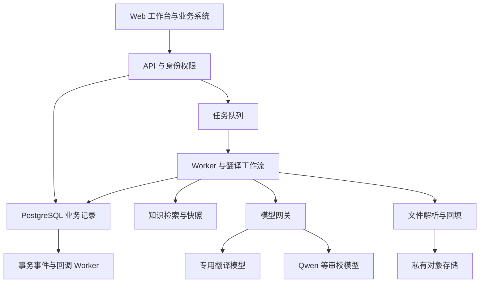
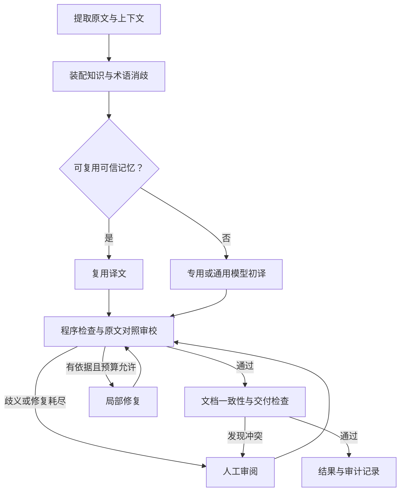

# AI 翻译平台技术方案

版本：1.0 · 日期：2026-09-23 · 状态：实施设计草案，未实施、未完成业务质量验证。

仓库：`xzhencheng/aifanyi`。需求来源为[一期需求基线](requirements.md)及用户后续明确的“翻译准确性是核心目标”“考虑专用翻译模型初译、Qwen 等通用模型审校”。对应的规范性实现要求见 [Spec](spec.md)。

## 1. 目标与设计原则

核心目标是减少真实业务材料中的严重误译、漏译、无依据增译和专业概念误用。流畅度、速度、成本分别统计，不用它们替代准确性。文件格式保持是交付约束，也不等于语义正确。

本方案选择“上下文和领域知识约束的初译 → 原文对照审校 → 有依据的局部修复 → 全文一致性与交付检查”。每个增加的模型环节必须通过独立业务样本证明净收益。任务执行成功不代表已人工确认准确；产品界面明确区分自动检查通过和人工审核通过。

### 1.1 一期范围

- 中文、英文、日文六个有向翻译方向；同语种改写不属于翻译接口。
- 文本同步/异步翻译、批量任务、Word `.docx` 和 Excel `.xlsx` 的受支持纯文本。
- 术语、翻译记忆、规则、领域解释材料的治理与版本快照。
- 对话式局部重译、四级反馈范围、项目/企业审核、结果及模型调用追溯。
- 调用系统鉴权、任务查询、文件下载、登记端点回调及运维。

一期不包括 PDF/OCR、PPT、旧 Office 格式、宏文件、图片中文字翻译、从零训练基础模型、多 Agent 自由协商。领域微调作为后续条件性工作，不是一期可用的前提。

### 1.2 决策类型

| 类型 | 本文含义 |
| --- | --- |
| 设计基线 | 开发按此实现；修改时同步更新 Spec 与决策记录 |
| 可配置初值 | 为实现和试点提供具体默认值，不是生产性能或质量承诺 |
| 待评测选型 | 保留可替换接口，不能将未经评测的模型标为正式上线 |
| 部署前输入 | 客户网络、身份系统、模型许可、设备资源、数据周期等环境参数 |

原方案的“99% 术语正确率、P95 5 秒、99.9% 可用性”等均为建议目标。准确性优先模式包含审校，响应时延须重新压测，不通过跳过审校来兑现旧目标。

## 2. 准确性的工程定义

| 维度 | 核查对象 | 举例 |
| --- | --- | --- |
| 原意与逻辑 | 主体、动作、对象、否定、条件、范围、因果、先后关系 | “确认后才允许”不能变成“操作后确认” |
| 信息完整 | 原文信息是否覆盖、译文是否加入无依据内容 | 限制条件和例外不能丢失 |
| 专业概念 | 术语是否适用于当前产品、部件和语境 | 同一简称在不同产品中可能指不同部件 |
| 参数关联 | 对象—参数—数值—单位—约束关系 | 数字集合相同但对应对象交换仍是错误 |
| 文档一致性 | 指代、简称、同一概念、交叉引用与表达约定 | 一份手册同一部件名称前后冲突 |
| 交付完整性 | 文本提取、回填映射、格式与非支持对象保留 | 正确译文写错单元格也属于失败 |

错误严重度采用项目规则：`critical` 表示可能改变安全操作、关键技术约束或造成重大业务后果；`major` 表示实质性改变或遗漏含义；`minor` 表示不改变关键含义的小问题。纯风格偏好单独记录，不计入语义错误。

数字、型号、ID 等确定性检查由程序执行；语义关系由原文对照审校和人工验证共同处理。模型分数只能辅助排序，不作为单独放行条件。语义审校并非形式化证明。

## 3. 总体架构与技术基线

采用模块化单体 API 加独立 Worker，先保持业务边界清楚，不按概念数量拆微服务。

| 层 | 设计基线 | 职责和约束 |
| --- | --- | --- |
| 前端 | TypeScript、React、Vite | 翻译、逐段审阅、知识审核、模型与运行配置 |
| API | Python、FastAPI、Pydantic | 强类型请求、鉴权、幂等、查询；不占用请求进程执行长文件任务 |
| 编排 | LangGraph 显式状态图 | 条件分支、有限修复、持久检查点、人工暂停 |
| 数据库 | PostgreSQL、SQLAlchemy、Alembic | 任务、片段、修订、知识版本、权限、审计、Outbox |
| 检索 | SQL 精确/词法检索；pgvector 可选 | 三类知识使用不同策略；向量索引不是业务真实数据来源 |
| 调度 | Celery、Redis | 派发、重试和限流；业务状态仍以 PostgreSQL 为准 |
| 模型推理 | 独立 HTTP 服务，优先验证 vLLM；模型专用后端经适配器接入 | 初译和审校可独立部署、独立扩缩容，不假设 API 能力一致 |
| 文件 | ZIP/XML 原位修改，受限解析进程 | 保留非目标部件；不能依赖整文档重建维持原格式 |
| 对象存储 | 私有 S3 兼容接口 | 原件、译文、报告、受控评测文件；部署时验证所选产品兼容性 |
| 身份 | 企业 OIDC；机器调用用注册客户端凭据 | 外部身份验证后映射项目权限；密钥不进入业务日志 |
| 可观测 | 结构化日志、指标、调用追踪 | 记录版本、用量、质量事件；正文追踪存储须单独授权 |

运行时和依赖精确版本在首个工程里程碑锁定并验证兼容性；不使用浮动 `latest` 镜像作为交付基线。逻辑架构可以在容器环境落地；具体 GPU、数据库高可用和身份提供方不在本文假定为已具备。

## 4. 专用翻译模型与通用审校模型

### 4.1 采用可比较的双模型路径

初译模型负责在知识约束下生成忠实译文；审校模型对照原文找错；修复模型根据确认的问题生成候选修订。模型可以共享底座，但角色、提示、输入和结果记录必须分开。审校不读取初译模型的隐藏推理，只读取可核验的原文、译文和知识证据。

“私有化部署”表示推理和数据位于指定环境；“领域微调”表示改变模型参数。私有化部署本身不提高语义准确率。专用翻译模型也不预设一定胜过通用模型，按语言方向和业务场景实测选择。

| 候选 | 一期定位 | 依据和限制 |
| --- | --- | --- |
| Hy-MT2-7B | 首轮私有化初译候选 | 官方提供权重及术语、风格等任务示例；具体六方向与格式能力须本项目实测 [R6] |
| TranslateGemma-12B | 第二个专用初译候选 | 官方开放模型；采用其专用模板，不能默认接受任意系统提示、术语表或 JSON 协议 [R7] |
| Qwen 指令模型 | 审校、修复候选；同时作为通用初译对照 | 选支持目标语言和所需输出协议的具体检查点；型号、精度和上下文配置由评测与设备确定 [R8] |
| Qwen-MT 服务 | 允许外部模型时的可选对照 | 本次核验的官方页面说明 API 服务；该页面不构成可下载权重和可私有部署的依据 [R9] |

候选信息核验日期为 2026-09-23。供应方基准成绩不作为本项目验收结果。实际交付记录模型 ID、权重修订、Tokenizer/Chat Template、量化方案、推理后端、采样参数和许可标识；模型权重及真实语料不提交代码仓库。

### 4.2 模型能力适配

`TranslatorAdapter` 接收平台标准片段，负责转换成模型实际支持的模板；`ReviewerAdapter` 输出平台错误结构；`RepairAdapter` 返回候选修订。

每个适配器登记：支持语言方向、输入/输出限制、术语干预、参考上下文、参考译文、结构化输出、行内标记、批量映射和部署边界能力。不支持某项必须显式报告，由路由选择已批准的替代路径，不能静默丢弃约束。

某些专用翻译模型只输出文本：默认每个语义片段一次请求，由程序绑定 `segment_id`。只有通过 ID 覆盖和分隔保留测试的适配器才能在一次模型请求中装入多个目标片段。推理服务动态批处理多个独立请求，不等于把多个段落拼成一条提示。

对不能直接使用必要上下文/术语的候选，可在实验组比较“专用初译＋带知识的修复”，但上线前必须证明满足同样的知识约束。不得把错误拼接的上下文当待翻译内容发送。

### 4.3 模型组合实验

| 组别 | 初译 | 知识与上下文 | 审校修复 | 目的 |
| --- | --- | --- | --- | --- |
| E0 | 候选通用模型 | 最小必要原文输入 | 无 | 单模型参考基线 |
| E1 | 同一通用模型 | 完整且相同的知识包 | 无 | 测知识包净收益 |
| E2 | 候选专用模型 | 其适配器支持的相同知识；差异必须记录 | 无 | 测专用初译能力 |
| E3 | 专用模型 | 完整知识要求 | Qwen 审校与定向修复 | 测用户提出的双模型路径 |
| E4 | 通用模型 | 与 E1 相同 | 与 E3 相同的审校策略 | 避免把所有改进归因于专用模型 |

按中→英、英→中、中→日、日→中、英→日、日→英分别评测；可以按方向选择不同组合。使用验证集选定模型和对照基线后再锁定测试，不能在测试集上反复选优。原文信息范围、允许知识和样本划分保持可比，模板差异单独记录。选型优先看严重错误和语义净收益，再看成本与时延。

### 4.4 部署和微调策略

初译和审校独立服务、独立队列配额。若部署环境提供两张 GPU，可分别分配模型以减少竞争，但显存和并发必须按实际检查点验证；不根据参数量直接承诺能同时驻留。容量估算覆盖权重、KV Cache、上下文、激活、并发和运行时开销。量化版本须重新做质量回归。

一期优先使用现成权重、领域知识和高质量示例。仅当有足量、经授权且经人工确认的平行语料，并确认现有错误可通过参数适配改善时，进入 LoRA/SFT 等微调实验。训练集与测试集按文档/项目分离；训练后同时检查六方向、通用能力退化和关键术语。微调版本经同一上线门槛审核，保留基础版本回滚。

## 5. 领域知识与上下文

### 5.1 知识资产

| 资产 | 必要内容 | 用法 |
| --- | --- | --- |
| 术语 | 概念 ID、定义、源语别名、目标语译法、允许变体、禁用译法、产品/部件/领域、例句、来源、锁定 | 原文匹配后消歧；检查概念和语境，不能只查目标字符串 |
| 翻译记忆 TM | 原文、译文、语言方向、上下文指纹、来源、审核、适用范围、知识兼容性 | 精确匹配通过资格检查才复用；相似结果仅参考 |
| 规则 | 语言/领域适用条件、强制与偏好、保护项、风格、审校和人工门槛 | 程序先合并为唯一有效配置，模型不得自行越权修改 |
| 领域解释材料 | 经过审核的产品说明和概念解释片段、定位、版本、适用范围 | 辅助消歧，不能补充原文没有的事实 |

领域解释材料复用知识审核和版本管理，不另建一个无边界的通用知识库。一期接受人工整理的纯文本解释片段；不因此扩大到 PDF/OCR 自动入库。

选择顺序：先按租户、项目权限、状态、语言方向、产品等筛选，再检索；企业强制/锁定项优先。非锁定项按“明确本次覆盖 → 当前用户个人项 → 项目项 → 企业默认”选择，只有允许覆盖的键能被覆盖。两项同优先级冲突进入待确认，不随机取第一条。项目机器任务默认不应用个人知识，只有明确授权的用户委托才可使用。

TM 是候选译文，不是高于规则的权威。复用要求原文精确匹配、上下文兼容、人工批准、适用范围正确、术语/规则版本兼容，并再次进行检查。旧术语影响的 TM 标记待复核，不能盲目全句替换。

### 5.2 上下文构建

- 保存原始文本和不损失语义的检索规范化文本，不能删除否定、单位、大小写敏感型号或标点关系。
- Word 按段落、列表层级和表格关系组织；Excel 关联工作表、行列标题和必要邻接单元格。
- 片段分开保存 `source_text` 与 `context_refs`。模型输出只对应目标片段，参考文本不重复翻译。
- 文档元数据、章节标题、产品/部件标识优先从结构和已知项目配置取得。可选摘要不能取代原文上下文，也不能被直接认定为事实。
- 明显缺失上下文、混合语种歧义、抽取异常标记问题。不能通过擅自修正原文消除疑点。
- 任务内概念选择在并发初译前尽量统一；新发现冲突保存待确认决策并重检关联片段，不让不同 Worker 各自写公共词表。

### 5.3 快照与缓存

创建任务时冻结知识发布版本、用户覆盖版本、检索器/Embedding 版本、模型路由和提示模板配置。每次检索保存命中条目及版本；后续发布不改变任务快照。实际模型调用的检查点和参数另行记录。

缓存键包含租户/权限范围、源文哈希、语言方向、上下文指纹、知识快照、模型/提示/推理参数和相关覆盖版本。系统生成缓存与人工批准 TM 分开；命中缓存不自动获得人工批准资格。不可通过只按源文字符串缓存造成跨项目泄漏或错用译文。

## 6. 翻译工作流与 Agent 边界

默认生产策略为 `accuracy_first`：每个目标片段均经过确定性检查与语义审校，包含复用 TM 的片段。跳过部分审校的快速策略仅作为离线实验，未通过独立评测不得默认上线。

| 节点 | 执行者 | 主要输出 |
| --- | --- | --- |
| `validate_input` | 程序 | 授权、语言、文件及限额检查 |
| `extract_segments` | 程序 | 稳定片段 ID、位置、原文、保护映射、未支持对象清单 |
| `build_context` | 程序为主 | 上下文引用、概念候选、歧义信号 |
| `resolve_knowledge` | 程序；必要时模型建议消歧 | 唯一知识包、有效规则、证据、待确认冲突 |
| `translate` | 模型或可信 TM | 译文候选、引擎记录、片段覆盖信息 |
| `check_deterministic` | 程序 | ID、空值、保护项、格式、术语候选问题 |
| `review_semantics` | 审校模型 | 有来源位置的语义问题，包含审校覆盖的全部片段 |
| `repair` | 修复模型 | 新候选修订、对应问题 ID；不覆盖初译记录 |
| `quality_gate` | 程序 | 通过、修复、人工审阅或技术失败 |
| `check_document` | 程序加按需跨段语义复核 | 同一概念、引用和参数的一致性问题 |
| `assemble_result` | 程序 | 文本/文件结果、结构检查、处理报告 |

LangGraph 状态保存 ID、阶段、片段引用、预算计数和快照标识；大文件与全量历史译文不放入不断增长的对话历史。业务数据库保存真实结果，检查点负责恢复位置。使用持久 Checkpointer，暂停人工审阅时释放执行资源。节点重放及队列重复投递需要业务幂等配合 [R1][R2][R3]。

对话助手仅能调用经鉴权的查询、解释、重译、反馈草稿接口。源文和检索材料均作为待处理数据，不能改变系统流程、发布知识或指定外部工具地址。助手产生的译法解释引用实际命中知识，不伪造原始模型推理过程。

## 7. 审校、修复与人工裁决

### 7.1 审校契约

审校读取原始片段、必要上下文、候选译文、已解析的术语和规则。复杂或高风险句额外核对“主体、动作、对象、否定、前置条件、范围、参数关联”等原文命题。命题抽取同样可能出错，必须保留可回查的原文锚点，不把抽取结果作为替代原文的真值。

每个问题包含：类型、严重度、片段 ID、源文位置、译文位置、依据、适用术语/规则 ID 和修复建议。纯润色建议单独返回。漏译允许译文位置为 `null`；增译允许源文位置为 `null`；必须满足相应类型的证据约束。程序检查锚点范围及原文逐字匹配，拒绝不存在的证据。

`reviewed_segment_ids` 必须覆盖本批所有目标片段；空问题数组只有在覆盖完整、输出有效且没有其他阻断问题时才可参与放行。不接受只返回总分的审校。

### 7.2 修复和放行

- 每个片段自动质量修复最多 2 轮。修复只针对有依据的错误，保留原始候选和每次修订。
- 修复后重新检查完整目标片段；涉及术语、指代和引用时同时重检关联片段。
- 有效证据显示修复退化时恢复上一候选并进入待审，不默认取最后一版。
- 未解决 `critical` / `major`、硬性保护或映射问题、审校失败、原文歧义均不得自动发布正式结果。
- 高风险场景即使模型未发现问题，仍需具备项目审核权限的人员终审；风险策略的下限由服务端规则确定。
- 人工可以纠正误报，但须记录证据。真实严重错误必须修改译文或更正源文；不能通过“忽略”把它标为准确。
- 源文更正创建新源文版本和子任务。新知识也以新快照创建重译子任务，不能篡改旧任务使用的依据。
- 一次人工修订最多触发 2 轮自动修复；所有修订保留累计次数。频繁反复转人工时标记升级，不无限循环。

平台的 `auto_passed` 只表示按该版本策略检查通过；`human_approved` 表示有人工裁决记录，两者都不表达无限范围的“保证正确”。研究报告了审校修订在特定数据上的收益，也报告了收益可能主要来自流畅度，必须用本项目数据验证 [R4][R5]。

## 8. 业务对象、状态与恢复

| 对象 | 作用 |
| --- | --- |
| Translation / Revision | 用户可见的翻译成果身份与不可覆盖的结果版本 |
| Job / Attempt | 一次执行及技术重试记录 |
| SourceArtifact / Segment | 不可变原件与精确原文位置映射 |
| Candidate / Issue / ReviewDecision | 初译、修订、问题与人工裁决 |
| KnowledgeEntry / Release / Snapshot | 知识草稿、发布和任务固定依据 |
| ModelProfile / ModelCall | 组合配置与每次真实调用信息 |
| Feedback / Proposal | 用户修正及待审核知识建议 |
| OutboxEvent / CallbackDelivery | 可靠业务事件及独立通知状态 |

任务公开状态：`queued`、`running`、`awaiting_review`、`succeeded`、`failed`、`canceled`。内部阶段和片段状态另存，不能把模型流式输出百分比当准确进度。完成计数以通过门槛的目标片段为准。

`succeeded` 要求全部目标片段可发布、文档一致性与文件结构检查通过，结果引用可用。非支持对象不算成功翻译片段；报告显式展示覆盖范围。待人工审阅时可查看草稿，但正式结果下载接口返回未就绪。

外部队列按至少一次交付设计。Worker 通过数据库租约与版本条件更新取得任务；结果以唯一执行键写入。提交完成结果和 Outbox 事件置于同一数据库事务。模型外部请求若在响应返回前网络中断，可能已经产生费用；没有供应方幂等支持时不能保证只调用一次，应记录 `outcome_unknown`。

取消在批次边界生效；迟到响应可以留存审计，但不能覆盖已取消任务或发布结果。技术重试仅在快照、原件和策略仍可使用时继续，否则拒绝并要求新任务。原件或知识历史版本被清理后不能假装可完整回放。

## 9. API 和工作台

接口规范、字段、幂等和错误码以 Spec 第 6 节为准。短文本默认同步上限 1000 Unicode 码点；超过上限使用异步接口。同步执行保留底层任务记录，准确性流程不被裁剪，超时返回可查询任务引用。

工作台提供：文本翻译、文件上传和范围确认、任务进度、原译对照审阅、问题定位、局部重译、知识审核、模型组合配置、调用系统清单和评测报告。用户看到“自动检查通过/人工审核通过/待确认”，不显示缺乏校准依据的准确率百分比。

配置界面分开显示初译、审校、修复模型，支持组合版本、语言方向、能力检测和可用状态。未评测组合只可用于实验环境；审核后发布为指定语言方向的生产组合。

## 10. Office 文件工程

### 10.1 共同策略

复制原始 OOXML 包，仅修改确认支持的文本节点；保留其他部件及关系。记录包部件、稳定节点定位、源文哈希和回填标记。拒绝损坏、加密、伪装类型和超过资源限制的压缩包。禁用 XML 外部实体、路径穿越、网络资源加载；限制条目数、解压体积和压缩比。

### 10.2 Word

段落作为主要语义单元，不按任意 run 单独翻译。将必要的行内样式、超链接边界表示为稳定成对标记，校验 ID、数量、配对和嵌套后回填。标记不能跨越不允许移动的结构边界；无法可靠保持的段落进入人工处理，不把译文全部挤入首个 run。

正文、表格、页眉、页脚受支持。域、修订标记、内容控件等复杂内容一期跳过并报告；带文本框、形状等对象的段落只翻译明确独立的普通文本部分。保护编号、书签、链接、分页和图片关系。语言长度导致分页变化时给出风险提示，不默认缩字。

### 10.3 Excel

只翻译选择范围内的字符串单元格，保留公式、数字、日期、样式、尺寸、合并区域、数据验证和隐藏状态。数字/日期单元格本身不翻译，但可作为只读上下文帮助理解相邻文本；正文中包含的数字和单位仍属句子语义，必须参与理解及保护。

共享字符串不能直接全局覆盖：对选择范围内需要变化的引用按需复制/重建对应条目，只重定向目标单元格，防止同一共享字符串在范围外被误改。富文本按可验证标记处理，不能可靠支持时原样保留并报告。以 `=` 开头的译文仍保存为字符串，不能新建公式。

### 10.4 验证与范围承诺

校验公式及关系、样式引用、图片、合并区域、书签和未目标部件等受保护结构；只比较对象数量不足以证明保留正确。允许受控更新共享字符串索引等必要元数据，需验证引用一致。

校验 ZIP/XML 可解析，并用代表性文件进行 Office/兼容阅读器人工打开检查。没有版式渲染引擎时仅能给出长度/行列尺寸风险估计，报告 `layout_check=heuristic`，不能宣称已经精确检测所有溢出。

## 11. 反馈与持续改进

仅本次修正形成新译文修订；个人修正写个人层；项目/企业修正经对应审核人发布。企业锁定项不可由普通反馈覆盖。

修正归因区分：术语缺失、概念误解、上下文不足、原文歧义、模型误译、提取/回填异常和风格偏好。AI 提议类别，审核人确认。整句修正不自动拆成公共术语；自动初译不自动成为正式 TM。

确认的错误进入有版本的回归集。进入训练/检索示例的数据不得继续充当独立测试样本；保留新的盲测集防止测试泄漏。模型或提示升级必须与旧版本成对比较，可按语言方向回滚。

## 12. 评测体系与发布门槛

### 12.1 数据集与标注

首轮可从 300–500 条具有上下文的脱敏样本启动候选筛选；正式验证依据覆盖程度和统计区间扩展，原方案 500–1000 条为建设参考，不是置信度保证。覆盖六方向、维保/手册/通知、表格短句、混合语种、否定/条件/数值等难例。

按文档/项目划分调试、验证、锁定测试集，去除近重复。评估者不看模型身份，懂业务的双语人员标注，严重问题和分歧复核。参考译文不是唯一正确答案，准确性优先按原意判断。

### 12.2 指标

| 指标 | 口径 |
| --- | --- |
| 严重错误片段率 | 含至少一个 critical 错误的片段数 / 可评估目标片段数 |
| 实质错误片段率 | 含 critical 或 major 的片段数 / 可评估目标片段数 |
| 漏译/增译片段率 | 含相应语义错误的片段数 / 可评估目标片段数 |
| 术语误用率 | 错误使用次数 / 经人工确认的适用术语出现次数；无适用项记 N/A |
| 必要人工修改率 | 需要改变含义相关内容的片段数 / 可评估片段数；风格偏好另计 |
| 审校召回与误报 | 对人工标注问题做匹配，分别统计严重问题漏检和无依据报错 |
| 修复净收益 | 同批片段修复后相对修复前的语义错误变化，并列纠正数和新增数 |
| 自动覆盖率 | 无需人工即可正式交付的片段数 / 全部目标片段数 |
| 文件成功率 | 范围内有效输入的完整交付任务数 / 同类任务总数 |
| 效率指标 | 按方向/模式统计 P50/P95 时延、吞吐、用量和单位成本 |

未完成、拒译、待审不能从分母中静默剔除；同时报告全输入集处置情况与可评估子集指标。不同语言分层报告，不用大量简单句掩盖高风险方向失败。自动评估器可作辅助；不能把模型评分 0.95 展示成“95% 准确”。

### 12.3 一期拟采用的上线判定

1. 所有关键保护、隔离、证据定位和已知严重误译回归用例通过；锁定测试集不得出现尚未解决的 critical 错误。
2. 对拟上线的语言方向，E3/E4 与预先确定的最强单模型对照比较。实质错误片段率不劣化，语义错误改进有成对评测证据；用文档级成对重采样给出 95% 区间。若区间不能支持提升，只能认定尚未证明增益，继续试点或维持此前已经通过门槛的生产组合。
3. 术语正确率参考目标 ≥99%，但以已确认适用项和明确样本覆盖为前提。其余绝对质量阈值、最低自动覆盖率和评测规模在试点评审中按场景登记，未登记不开放该场景生产路由。
4. 保留人工审阅可见性，不能通过把全部内容转人工来声称自动翻译更准确。
5. 数据集、标注版本、组合配置、Tokenizer、硬件/量化、抽样方法和报告必须可重现。评测零观测严重错误不等于真实总体错误率为零。

## 13. 安全、回调与运维

鉴权和项目范围限制在所有检索、任务、审阅和下载接口执行；正文、密钥和真实客户语料不进入公开仓库。静态与传输加密由部署提供，生产正文追踪默认关闭。密钥只保存 Secret 引用。

客户端只提交登记的回调编码。端点与客户端、项目/环境绑定，停用立即阻止新投递。只连接经过审核的 HTTPS 目标，不跟随重定向；DNS 与目标网段按部署允许清单检查，内网集成需显式登记，拒绝本机和云元数据等禁止目标。

一期回调基线为 HMAC-SHA256；mTLS/OAuth2 为后续适配，不声称已实现。业务结果和 Outbox 原子提交；通知失败不反转翻译完成状态。重试共享 `event_id`，调用方去重。任务查询作为兜底。

模型初译、审校和修复分别限流，处理供应方并发、超时、429 与输出截断。审校不可用时任务重试或失败/待审，不直接放行未经审校结果。记录阶段耗时、模型使用量、队列积压、问题类别、修复净收益和回调积压。

定期备份数据库、必要对象和快照；恢复演练验证三者一致性。保留周期通过部署配置明确，过期文件返回 `410`，不生成无效下载地址；清理过程保留最小审计元数据并报告回放受限。

## 14. 实施顺序与验收产物

| 里程碑 | 核心交付 | 完成条件 |
| --- | --- | --- |
| M0 质量基线与模型 PoC | 数据划分、标注规范、E0–E4 试验、模型能力验证；同时做 Office 小样本往返 | 明确候选组合、错误基线、文件风险和未验证项 |
| M1 准确性内核 | 片段/知识包、初译、原文审校、修复、人工判断、记录和同步接口 | 关键语义难例可定位处理；失败不能伪成功 |
| M2 持久任务与治理 | 异步状态、恢复、知识审核、版本快照、反馈、权限和回调 | 状态、发布与事件闭环可追踪 |
| M3 Office 与工作台 | 范围确认、纯文本翻译、原位回填、结构报告、逐段审阅 | 代表性 Word/Excel 样本满足边界和保护要求 |
| M4 试点发布 | 盲评、组合发布门槛、部署/运维/接口手册 | 对选定语言方向证明准确性收益，完成安全与恢复验证 |

可并行推进样本与工程设计，但不能用界面完成度代替质量里程碑。当前文档不代表上述里程碑已完成。

## 15. 风险与部署前输入

| 项目 | 当前处理 | 上线前必须取得的依据 |
| --- | --- | --- |
| 专用模型是否优于通用模型 | E0–E4 对照，不预设结论 | 按语言方向的业务盲评 |
| 审校幻觉与过度修改 | 证据定位、保留旧候选、回归、人工分歧处理 | 召回、误报及净收益报告 |
| 私有推理容量 | 模型服务独立，先测质量再确定精度/并发 | GPU 型号/数量/显存、目标并发、压测 |
| 知识质量 | 定义、范围、来源和发布审核 | 权威词表、领域负责人、脱敏资料 |
| 原文固有歧义 | 显式待确认，源文更正另建版本 | 业务解释与裁决人员 |
| Office 复杂对象 | 提前往返验证，明确跳过和提示 | 真实结构的脱敏样本 |
| 企业身份与数据边界 | OIDC 与注册客户端，默认私有 | IdP、网络、外部模型允许清单、保留周期 |
| 模型使用与分发 | 记录所选权重和许可版本 | 部署主体确认使用、微调、分发条件 |

## 16. 技术依据

以下来源用于核对框架能力及候选模型可用性，不代表本项目效果已经获得验证。本文其余流程、门槛和接口为项目设计。访问日期：2026-09-23。

- [R1] [LangGraph：Workflows and agents](https://docs.langchain.com/oss/python/langgraph/workflows-agents)：区分显式流程和动态 Agent。
- [R2] [LangGraph：Persistence](https://docs.langchain.com/oss/python/langgraph/persistence)：工作流状态持久化。节点恢复仍需业务幂等设计。
- [R3] [Celery：Tasks](https://docs.celeryq.dev/en/stable/userguide/tasks.html)：任务确认、重试和幂等约束。
- [R4] [TEaR，NAACL 2025](https://aclanthology.org/2025.findings-naacl.218/)：所测数据中，翻译、评价和修订提高了质量。
- [R5] [What Does LLM Refinement Actually Improve? ACL 2026](https://aclanthology.org/2026.acl-long.268/)：文学文档实验中，修订收益主要来自流畅度；不可直接外推电梯技术资料。
- [R6] [Tencent Hy-MT2 官方仓库](https://github.com/Tencent-Hunyuan/Hy-MT2)：权重、推理与任务输入示例。
- [R7] [Google TranslateGemma-12B 官方模型卡](https://huggingface.co/google/translategemma-12b-it)：模型、语言与输入协议，以实际检查点为准。
- [R8] [Qwen 官方 Quickstart](https://qwen.readthedocs.io/en/latest/getting_started/quickstart.html)：本地模型使用与推理服务示例。
- [R9] [Qwen-MT 官方说明](https://qwenlm.github.io/blog/qwen-mt/)：本次核验页面描述 API 翻译能力。

## 17. 与 Spec 的关系

本方案说明“为什么这样设计、如何实现”；[Spec](spec.md)规定 MUST/SHOULD、数据与接口契约、状态转换、验收用例和追踪关系。文档须同时维护；不得用 Spec 静默缩减准确性检查或扩大业务文件范围。设计变更先记录原因及质量影响，再同步两份文档。
